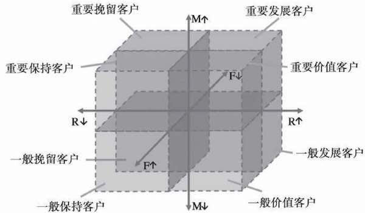
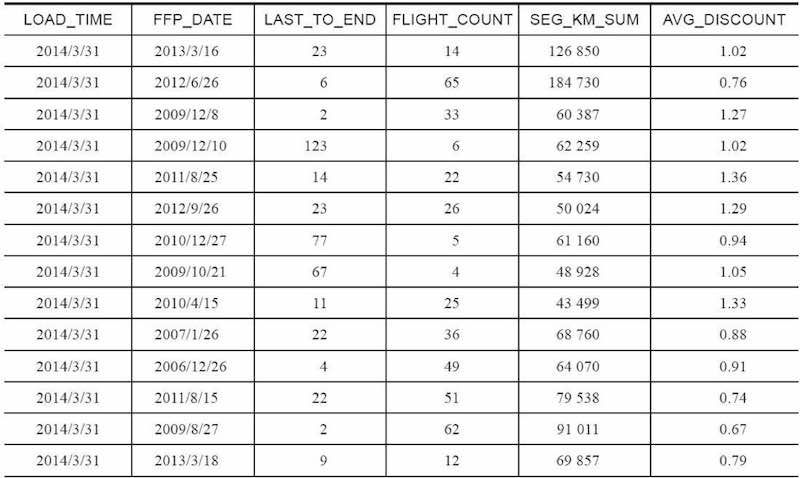
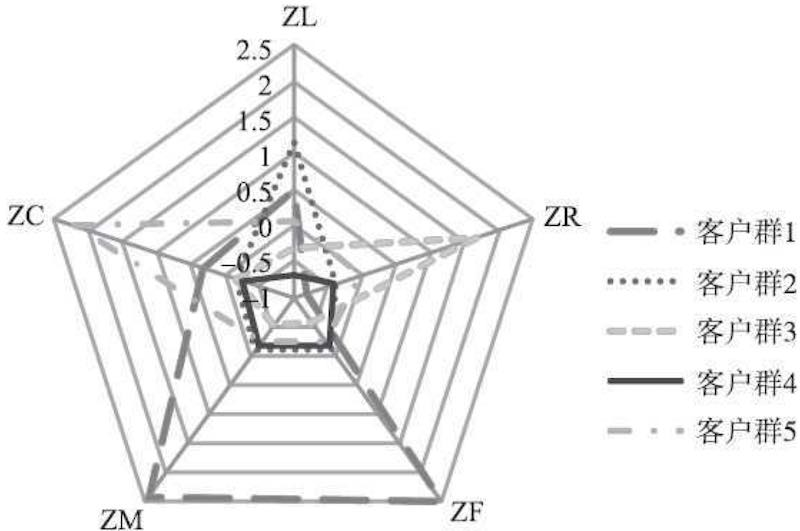
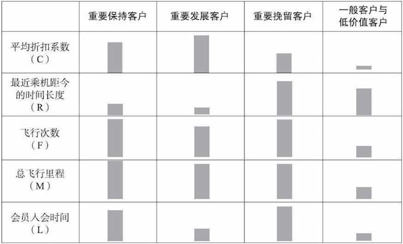

# 航空公司客户价值分析

## 背景

通过客户分类，区分无价值客户、高价值客户，企业针对不同价值的客户制定优化的个性化服务方案，采取不同营销策略

数据：

1.[航空信息属性表](data/airline_attributes.xls)

2.航空信息数据表：

> 一行一个会员卡号，列名与上面的属性表一一对应

目标：
1. 借助航空公司客户数据，对客户进行分类
2. 对不同的客户类别进行特征分析，比较不同类客户的客户价值
3. 对不同价值的客户类别提供个性化服务，制定相应的营销策略

## 分析方法和过程

通过3个指标（最近消费时间间隔（Recency）、消费频率（Frequency）和消费金额（Monetary））来进行客户细分，识别出高价值的客户，简称RFM模型。接下来依此分析各个指标：

**消费金额**：一段时间内，客户购买该企业产品金额的总和

> 航空还受到运输距离、仓位等多种影响，并不能仅仅通过消费金额来判断，例如：一位购买长航线、低等级舱位票的旅客与一位购买短航线、高等级舱位票的旅客相比，后者对于航空公司而言价值可能更高。因此除了RFM模型的三个指标以外，还要增加三个反映上述因素的指标，合在一起，统称为LRFMC模型： 

**L**：客户关系长度 
**R**：消费时间间隔 
**F**：消费频率 
**M1**：消费金额 
**M2**：一定时间内的**累积飞行里程** 
**C**：一定时间内的**仓位折扣系数均值** 

传统的RFM模型采用属性分箱（根据各维度与均值对比的大小）的方法，来划分不同的客户群体，然而这样细分的客户群太多，提高了针对性营销的成本。因此，本例采用了**聚类**的方法识别客户价值，通过对航空公司客户价值的LRFMC模型的五个指标进行K-Means聚类，识别出最有价值的客户。

过程： 

## 数据抽取

**结束时间点**：对已有样本，以建模日期为结束时间点，作为**历史数据**；对后续新增客户、以最新成绩时间点作为结束时间点，作为**增量数据** 
**时间跨度**：选取宽度为两年的时间段作为分析观测窗口，抽取客户的乘机记录 
**字段**：卡号、入会时间、性别、年龄、会员卡级别、工作地城市、工作地所在省份、工作地所在国家、观测窗口结束时间、观测窗口乘机积分、飞行公里数、飞行次数、飞行时间、乘机时间间隔和平均折扣率等 

## 数据探索分析

缺失值分析与异常值分析 

* 票价为空数据：客户不存在乘机记录造成
* 票价最小值为0、折扣率最小值为0：0折机票、积分兑换产生

[代码：数据探索分析](code/7-1_data_explore.py)

## 数据预处理

### 1.数据清洗

丢弃票价为空的记录。·丢弃票价为0、平均折扣率不为0、总飞行公里数大于0的记录。这些数据对建模影响不大，可以直接丢弃

[代码：数据清洗](code/7-2_data_clean.py)

### 2.属性规约

原始数据中属性太多，根据航空公司客户价值LRFMC模型，选择与LRFMC指标相关的6个属性：

* FFP_DATE、LOAD_TIME、FLIGHT_COUNT、AVG_DISCOUNT、SEG_KM_SUM、LAST_TO_END

删除其他不相关、弱相关、或者冗余的数据。属性选择后的数据集样本如下： 

### 3.特征构造

上面的原始数据没有直接给出LRFMC五个指标，需要通过原始数据提取这5个指标 

* `L = LOAD_TIME - FFP_DATE`

	> 会员入会时间距观测窗口结束的月数＝观测窗口的结束时间－入会时间[单位：月]

* `R = LAST_TO_END`

	> 客户最近一次乘坐公司飞机距观测窗口结束的月数＝最后一次乘机时间至观察窗口末端时长[单位：月]

* `F＝FLIGHT_COUNT`

	> 客户在观测窗口内乘坐公司飞机的次数＝观测窗口的飞行次数[单位：次]

* `	M＝SEG_KM_SUM`

	> 客户在观测时间内在公司累计的飞行里程＝观测窗口的总飞行公里数[单位：公里]

* `C＝AVG_DISCOUNT`

	> 客户在观测时间内乘坐舱位所对应的折扣系数的平均值＝平均折扣率[单位：无]

### 4. 数据变换

提取上述5个特征之后，对分布情况惊醒分析，发现指标取值范围差异较大。KMeans是基于距离的算法，为了消除数量级数据带来的影响，需要对数据进行标准化处理。 

[代码：标准差标准化](code/7-3_zscore_data.py)

标准差标准化处理之后，形成ZL、ZR、ZF、ZM、ZC五个属性数据 

## 模型构建

分为两部分：（1）对客户进行聚类分群；（2）结合业务对每个客户群进行特征分析，分析其客户价值，并对每个客户群进行排名

### 1.客户聚类

类别数为5 

[代码：聚类](code/7-4_KMeans_cluster.py)

聚类结果

### 2. 客户价值分析

客户群特征 

客户群特征描述表 

基于该特征描述，本案例定义五个等级的客户类别：重要保持客户、重要发展客户、重要挽留客户、一般客户、低价值客户。他们之间的区别如图74所示，其中每种客户类别的特征如下：

**重要保持客户：**

> 这类客户的平均折扣率（C）较高（一般所乘航班的舱位等级较高），最近乘坐过本公司航班（R）低，乘坐的次数（F）或里程（M）较高。他们是航空公司的高价值客户，是最为理想的客户类型，对航空公司的贡献最大，所占比例却较小。航空公司应该优先将资源投放到他们身上，对他们进行差异化管理和一对一营销，提高这类客户的忠诚度与满意度，尽可能延长这类客户的高水平消费。

**重要发展客户：**

> 这类客户的平均折扣率（C）较高，最近乘坐过本公司航班（R）低，但乘坐次数（F）或乘坐里程（M）较低。这类客户入会时长（L）短，他们是航空公司的潜在价值客户。虽然这类客户的当前价值并不是很高，但却有很大的发展潜力。航空公司要努力促使这类客户增加在本公司的乘机消费和合作伙伴处的消费，也就是增加客户的钱包份额。通过客户价值的提升，加强这类客户的满意度，提高他们转向竞争对手的转移成本，使他们逐渐成为公司的忠诚客户。

**重要挽留客户：**
	
> 这类客户过去所乘航班的平均折扣率（C）、乘坐次数（F）或者里程（M）较高，但是较长时间已经没有乘坐本公司的航班（R）高或是乘坐频率变小。他们客户价值变化的不确定性很高。由于这些客户衰退的原因各不相同，所以掌握客户的最新信息、维持与客户的互动就显得尤为重要。航空公司应该根据这些客户的最近消费时间、消费次数的变化情况，推测客户消费的异动状况，并列出客户名单，对其重点联系，采取一定的营销手段，延长客户的生命周期。

**一般与低价值客户：**

> 这类客户所乘航班的平均折扣率（C）很低，较长时间没有乘坐过本公司航班（R）高，乘坐的次数（F）或里程（M）较低，入会时长（L）短。他们是航空公司的一般用户与低价值客户，可能是在航空公司机票打折促销时，才会乘坐本公司航班。

### 3.客户生命周期分析

### 4.客户价值排名

### 5.模型应用

