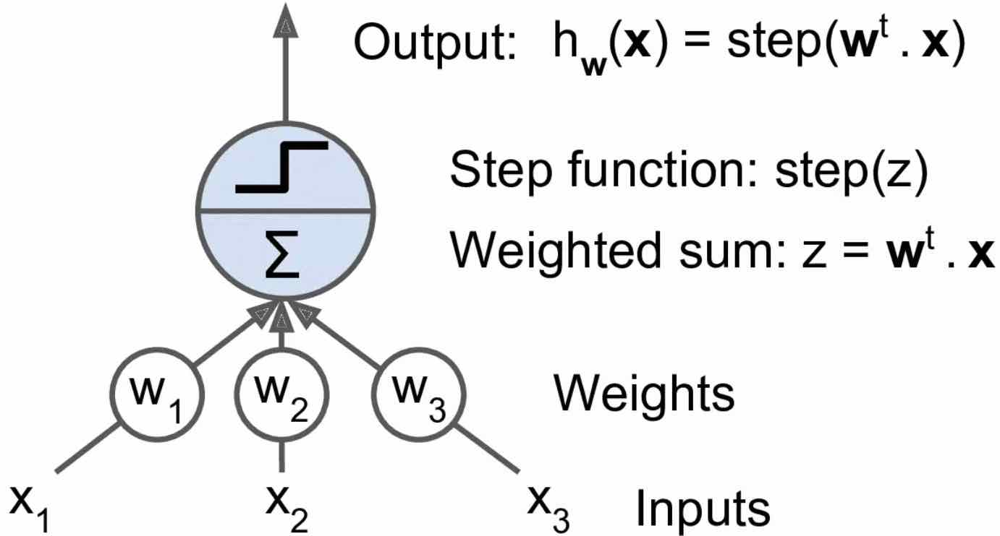
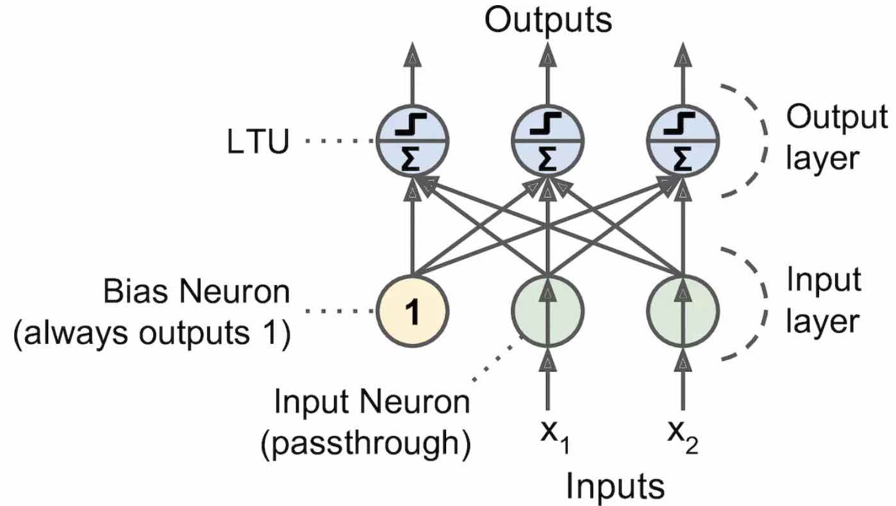
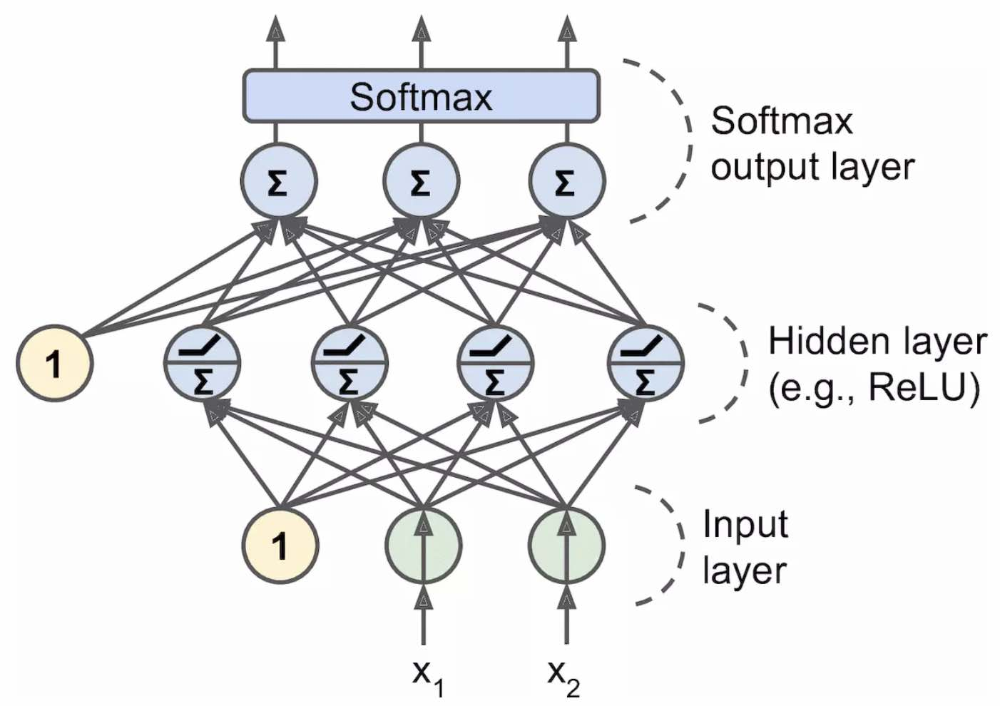

# 人工神经网络（ANN：Artificial Neural Network）

## 1.感知器（Perceptron）

**(1) 线性阈值单元（LTU）** 
感知器基于线性阈值单元。线性阈值单元（LTU）的接收多路输入，每一路输入都有对应的连接权重（Wi），而连接权重也正是模型要训练的参数。LTU根据连接权重对输入加权求和（Z=W1X1+W2X2 +...+WnXn=WT·X），然后将阶跃函数（Step Function）应用于该和，并输出结果：hW(X)=step(Z)=step(WT·X)

**(2) 阶跃函数** 
阶跃函数（Step Function，对应上图中的step(Z）），可以理解为是一个判别函数，用来根据Z的取值决定LTU的最终输出，常见的阶跃函数例如：heaviside阶跃函数，sgn符号函数

**(3) 感知器网络结构** 
**单一的LTU**可被用作简单线性二元分类。它计算输入的线性组合，如果结果超过阈值，它输出正类或者输出负类（功能类似逻辑回归分类或线性SVM） 
**感知器**简单地由一层 LTU 组成，每个神经元连接到所有输入。这些连接通常用特殊的被称为输入神经元的传递神经元来表示：它们只输出它们所输入的任何输入。此外，通常添加额外偏置特征（X0=1）。这种偏置特性通常用一种称为偏置神经元的特殊类型的神经元来表示，它总是输出 1 

**训练原理来源**：如果一个神物神经元总是触发另一个生物神经元，两个神经元之间的连接就会变得更强
**感知器收敛定理**：如果训练集是线性可分的（与LR一样无法学习复杂模式），算法会收敛到一个解
**感知器与LR的差别**：LR能够预估分类概率，感知机只是输出一个类别，因此更应该使用LR；介绍感知器只是用来引入更复杂的神经网络

**(4) 代码** 

~~~python
import numpy as np
from sklearn.datasets import load_iris
from sklearn.linear_model import Perceptron

iris = load_iris()
X = iris.data[:, (2, 3)]  # petal length, petal width
y = (iris.target == 0).astype(np.int)

per_clf = Perceptron(max_iter=100, tol=-np.infty, random_state=42)
per_clf.fit(X, y)

y_pred = per_clf.predict([[2, 0.5]])
~~~

## 2. 多层感知机（MLP)

(1) **MLP(多层感知机）**：包含1个输入层(输入层中的每个神经元负责传递一个输入特征)，1个或多个隐藏层(LTU)，1个被称为输出层LTU所组成的最终层；另外每层都包含一个偏移神经元（bias，偏移神经元的输出总是1）。与感知器不同，多层感知机可以通过输出层的softmax预估概率。 

(2) **DNN(深度神经网络）**：有2个或2个以上的隐藏层

(3) **反向传播训练法（反向自动微分：P234）**：对每个样本，先做一次预测（正向传播），度量误差，再反向遍历每个层次来度量每个连接的误差贡献度（反向传播），最后再微调每个连接的权重来降低误差（梯度下降）

(4) **激活函数**：为了让反向传播工作，需要把（没有梯度的）阶跃函数改成其他（有梯度的）激活函数（图10-8，P235），因为阶跃函数只包含平坦的段，因此没有梯度来工作（梯度下降不能在平面上移动）。常用的激活函数例如：

* **logistic:** `σ(z) = 1 / (1 + exp(–z))` 
logistic 函数到处都有一个定义良好的非零导数，允许梯度下降在每步上取得一些进展
* **tanh(双曲正切激活函数）**：`tanh (z) = 2σ(2z) – 1` 
是S形的、连续的、可微的，但是它的输出值范围从-1到1（不是在logistic函数的0到1），这往往使每层的输出在训练开始时或多或少都正则化了（即以0为中心）。这常常有助于加快收敛速度
* **relu:**`ReLU (z) = max (0, z)` 
它是连续的 
虽然在z=0时不可微（斜率突然改变，这可以使梯度下降反弹）。然而，在实践中，它工作得很好，并且具有快速计算的优点。 
最重要的是，它没有最大输出值的事实也有助于减少梯度下降期间的一些问题(后续章节介绍）

> 生物神经元使用的是一个粗糙的S型激活函数，而机器学习实践中ReLU效果更好

代码如下：

~~~python
# logistic激活函数
def logistic(z):
    return 1 / (1 + np.exp(-z))

# relu激活函数
def relu(z):
    return np.maximum(0, z)

# 双曲正切激活函数
def derivative(f, z, eps=0.000001):
    return (f(z + eps) - f(z - eps))/(2 * eps)
~~~

(5) MLP经常被用于做分类，在每个分类是互斥的情况下，通常将输出层修改为一个全联接的soft-max函数

(6) 下图是一个用于分类的MLP网路的例子：2个特征，激活函数使用ReLU，全联接层使用soft-max

## 3.用Tensorflow的高级API来训练MLP

代码： 

~~~python
import tensorflow as tf

(X_train, y_train), (X_test, y_test) = tf.keras.datasets.mnist.load_data()
X_train	= X_train.astype(np.float32).reshape(-1, 28*28) / 255.0
X_test  	= X_test.astype(np.float32).reshape(-1, 28*28) / 255.0
y_train 	= y_train.astype(np.int32)
y_test 	= y_test.astype(np.int32)
X_valid, X_train	= X_train[:5000], X_train[5000:]
y_valid, y_train 	= y_train[:5000], y_train[5000:]

feature_cols = [tf.feature_column.numeric_column("X", shape=[28 * 28])]  #ding
dnn_clf = tf.estimator.DNNClassifier(hidden_units=[300,100], n_classes=10, feature_columns=feature_cols)
# 训练
input_fn = tf.estimator.inputs.numpy_input_fn(x={"X": X_train}, y=y_train, num_epochs=40, batch_size=50, shuffle=True)
dnn_clf.train(input_fn=input_fn)
# 测试集测试
test_input_fn = tf.estimator.inputs.numpy_input_fn(x={"X": X_test}, y=y_test, shuffle=False)
eval_results = dnn_clf.evaluate(input_fn=test_input_fn) 
# 预测
y_pred_iter = dnn_clf.predict(input_fn=test_input_fn)
y_pred = list(y_pred_iter)
y_pred[0]
~~~

## 4. 用纯tensorflow训练DNN： 
见底部的附录1

## 5. 微调神经网络的超参数
**方法：**
(1）交叉验证：要调的超参数太多 
(2)	随机搜索：会好一些 
(3)	使用Oscar通过更复杂的算法来更快地找到超参数:  http://oscar.calldesk.ai/  
**能调的超参数：**拓扑、层数、每层神经元数量、每层的激活函数、初始化权重逻辑  
**(1)	拓扑**  
**(2)	层数**：分层架构帮助DNN更快归纳出好方案、还能提供泛化能力  

> 深层网络可以用非常少的神经元建模复杂网络，训练更快（隐藏层建模低层结构、中级层建模中层结构，高几层和输出层建模高层结构） 
> 对大多数问题1-2个隐藏层百个神经元（如MNIST数据集分类），对于更复杂的问题需要增加分层，非常复杂的问题（如图片、语音）需要数十层甚至数百层（不过很少重头训练、可以重用别人训练好的类似的模型）

**(3)	输入输出层的节点数**： 
根据任务要求决定  

**(4)	隐藏层节点数**： 

> 漏斗形尺寸(每层神经元数量依次减少，较多的低级结构合并成较少的高级结构)；
> 实践中也经常层数相同；
> 调参时逐渐增加直到发生过拟合
> 另一个做法是使用比实际需要更多的层次和神经元，然后提前结束训练，同时使用dropout之类其他的正则化技术

**(5)	隐藏层激活函数**（书本CH11详细讨论，对应笔记是12）
> 大多数情况可以使用ReLU或其变种：速度快、因为对大输入值没有上限，会导致无法终止

**(6) 输出层**：softmax用于不互斥的分类任务；回归任务不使用激活函数

## 附录1: 用纯tensorflow训练DNN

~~~python
import tensorflow as tf

n_inputs = 28*28  # MNIST
n_hidden1 = 300   # 第一层300个神经元
n_hidden2 = 100   # 第二层100个神经元
n_outputs = 10     # 输出层10个神经元

reset_graph()
X	= tf.placeholder(tf.float32, shape=(None, n_inputs), name="X")  #样本特征占位符
y	= tf.placeholder(tf.int32, shape=(None), name="y")  #样本分类标签占位符

# 定义神经网络的函数，其实不需要写这个函数，TF提供了API如fully_connected可以直接替换下面这个函数
def neuron_layer(X, n_neurons, name, activation=None): 
    with tf.name_scope(name):  #以该层的名字来定义name_scope
        # 输入神经元的数量
        n_inputs = int(X.get_shape()[1])  
        # W初始化为截断(保证不存在影响训练的大权重)正态分布，标准差为2/sqrt(n)
        # 用来避免导致梯度无法下降的对称性（例如全0权重、会导致神经元输出全0、误差梯度相同，所有权重更新都相同）
        stddev = 2 / np.sqrt(n_inputs)   
        init = tf.truncated_normal((n_inputs, n_neurons), stddev=stddev)
        W = tf.Variable(init, name="kernel")
        # 初始化偏重
        b = tf.Variable(tf.zeros([n_neurons]), name="bias")
        # 定于该层输出的计算方法
        Z = tf.matmul(X, W) + b
        # 使用激活函数，没有激活函数直接返回激活前的计算值
        if activation is not None:
            return activation(Z)
        else:
            return Z

with tf.name_scope("dnn"):  # 定义3个网络层
    hidden1 = neuron_layer(X, n_hidden1, name="hidden1", activation=tf.nn.relu)
    hidden2 = neuron_layer(hidden1, n_hidden2, name="hidden2", activation=tf.nn.relu)
    logits = neuron_layer(hidden2, n_outputs, name="outputs")

with tf.name_scope("loss"):  # 定义输出层(softmax)的损失函数（使用交叉熵）
    # 除了tf.nn.sparse_softmax_cross_entropy_with_logits, TF还提供了其他计算交叉熵的函数
    # sparse_softmax_cross_entropy_with_logits比先应用softmax再计算cross_entroy高效并且能处理边界情况：P240
    # 因为logits值是0-9，因此用sparse_softmax_cross_entropy_with_logits
    # 如果logits值是one-hot，使用softmax_cross_entry_with_logits
    xentropy = tf.nn.sparse_softmax_cross_entropy_with_logits(labels=y, logits=logits)
    loss = tf.reduce_mean(xentropy, name="loss")

learning_rate = 0.01

with tf.name_scope("train"):  #定义训练操作，用梯度下降的方式来最小化
    optimizer = tf.train.GradientDescentOptimizer(learning_rate)
    training_op = optimizer.minimize(loss)

with tf.name_scope("eval"):   #定义准确率估算节点
    correct = tf.nn.in_top_k(logits, y, 1)  #样本标签与得分最高的logits相同时为1，否则为0
    accuracy = tf.reduce_mean(tf.cast(correct, tf.float32)). #转成浮点数再计算均值

# 初始化
init = tf.global_variables_initializer()
saver = tf.train.Saver()

n_epochs = 40
batch_size = 50

# 从样本集中取一个mini-batch
def shuffle_batch(X, y, batch_size):
    rnd_idx = np.random.permutation(len(X))
    n_batches = len(X) // batch_size
    for batch_idx in np.array_split(rnd_idx, n_batches):
        X_batch, y_batch = X[batch_idx], y[batch_idx]
        yield X_batch, y_batch

# 执行数据流图，训练模型，并保存到文件
with tf.Session() as sess:
    init.run()
    for epoch in range(n_epochs):
        for X_batch, y_batch in shuffle_batch(X_train, y_train, batch_size):
            sess.run(training_op, feed_dict={X: X_batch, y: y_batch})
        acc_batch = accuracy.eval(feed_dict={X: X_batch, y: y_batch})
        acc_val = accuracy.eval(feed_dict={X: X_valid, y: y_valid})
        print(epoch, "Batch accuracy:", acc_batch, "Val accuracy:", acc_val)
    save_path = saver.save(sess, "./my_model_final.ckpt")

# 执行数据流图，加载模型，并对测试集进行预估
with tf.Session() as sess:
    saver.restore(sess, "./my_model_final.ckpt") # or better, use save_path
    X_new_scaled = X_test[:20]
    Z = logits.eval(feed_dict={X: X_new_scaled})
    y_pred = np.argmax(Z, axis=1)

# 输出
print("Predicted classes:", y_pred)
print("Actual classes:   ", y_test[:20])
~~~

