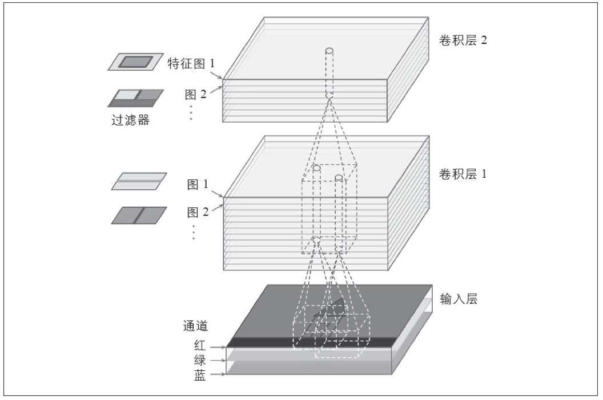

# CNN-卷机神经网络(Convolutional Neural Networks)

## 1.原理
动物视觉皮层神经元的局部接受野，不同神经元对接受野刺激作出的反应不同（有横向、纵向、其他方向，小接受野，大接受野，符合在低阶神经元输出基础上的高阶接受野） 
为什么不直接用全联接层，而要经过接受野的处理呢，100*100图像有10000像素，如果第一个隐藏层有1000个神经元，那么从输入层到第一个隐藏层就要有10000000个联接 

## 2.卷积核中的过滤器

例子:  

左侧的卷积核使用了两个过滤器； 
输入图片（右侧第1张）被这两个过滤器处理后，分别得到两个特征图（右侧第2、3张） 

代码：[代码CNN.01 卷积原理演示1 - 过滤器](14_cnn_code/14_code_01_convolution_demo_1_filter.md) 

过滤器有三个超参数: 

* 接受野：过滤词每一步覆盖的输入区域
* 步幅：过滤器每一步移动的距离，超过1的步幅，可以输入一个大层，输出一个小层
* Padding方式：
    * Zero-Padding（步幅为1时，Zero-Padding可以让上一层与下一层有相同的高*宽）
    * VALID-Padding (不会补0，会忽略无法覆盖的部分）

## 3.卷积层的结构

一个**卷积层**会使用多个过滤器，对相同的多通道输入特征，产出多个特征图（每个过滤器、读取N个通道的输入、输出一个特征图），以上图为例:  

1. 输入层：3通道(RGB)
2. 卷积层1：K个过滤器（每个过滤器、读取3个通道的输入、输出一个特征图）、总共输出K个特征图，为卷积层1的输出
3. 卷积层2：L个过滤器（每个过滤器、读取K个通道的输入、输出一个特征图）、总共输出L个特征图，为卷积层2的输出

**代码：** 
[代码CNN.02 卷积原理演示2 - 用自定义过滤器组装卷积核](14_cnn_code/14_code_02_convolution_demo_2_conv_core_with_self_defined_filter.md) 
[代码CNN.03 卷积原理演示3 - 使用TF Lib提供的卷积核](14_cnn_code/14_code_03_convolution_demo_3_conv_core_with_tf_lib.md) 
[代码CNN.04 卷积原理演示4 - VALID和SAME填充](14_cnn_code/14_code_04_convolution_demo_4_valid_and_same_padding.md) 

## 4.一个卷积层的一个神经元（特征图k第i行j列位置上神经元）的输入和输出

输入：上一个输入层接受野范围内(长*宽) * 通道数量（深度）神经元的输出 * 权重 + 特征图k的偏置

## 5.卷积层的问题

**问题**：内存需求大

* 预测过程中：因为只有前向传播，只需要缓存两个卷积层的神经元数据
* 训练过程中：因为还有后向传播，需要缓存所有卷基层的神经元数据

**解决办法**：

* 减小批次尺寸
* 减少步幅
* 减少特征图图层数
* 用16位替代32位符点精度
* 分发CNN到多台机器上

## 6.池化（Pooling）

**用途**：通过对输入图像进行二次采样来减小计算负载、内存利用率、参数数量（从而降低过拟合风险），同时也可以使神经网络容忍一定的图像位移（位置不变性） 

**超参数**（没有权重）：接受野高*宽，步幅，填充类型（VALID，SAME），聚合函数（max，mean） 


**池化层结构**：如上图

* 通常在各通道独立工作、输出深度与输入深度相同
* 也可也选择在深度为度进行叠加，这种情况下，空间为度（高和宽）不受叠加影响，但是通道数量减少了

[代码CNN.05 池化层](14_cnn_code/14_code_05_pooling.md)

## 7.CNN图片分类

**API**：`tf.layers.dense()`, `conv2d()` and `dropout()`

> 不再使用`tensorflow.contrib.layers.fully_connected()`, `conv2d()` and `dropout()`
> contrib的代码都是临时package

For all these functions:

* the scope parameter was renamed to name, and the _fn suffix was removed in all the parameters that had it (for example the activation_fnparameter was renamed to activation).
The other main differences in tf.layers.dense() are:
* the weights parameter was renamed to kernel (and the weights variable is now named "kernel" rather than "weights"),
* the default activation is None instead of tf.nn.relu
The other main differences in tf.layers.conv2d() are:
* the num_outputs parameter was renamed to filters,
* the stride parameter was renamed to strides,
* the default activation is now None instead of tf.nn.relu.
The other main differences in tf.layers.dropout() are:
* it takes the dropout rate (rate) rather than the keep probability (keep_prob). Of course, rate == 1 - keep_prob,
* the is_training parameters was renamed to training.

**代码：**[代码CNN.06 MNIST图片分类](14_cnn_code/14_code_06_mnist_cnn_classification.md)

## 8.TensorFlow提供的卷积操作

`conv1d()`：处理一维输入（如覆盖句子中相邻的几个单词） 
`conv3d()`：处理三维输入（如三位PET扫描） 
`atrous_conv2d()`：创建带孔的卷积层，通过插入0值来让输入扩大K倍，相当于扩大了接受野 
`conv2d_transpose()`：创建转置卷积层（去卷积层），通过插入0值来提升图像采样，例如，在典型CNN中特征图越来越小，通过conv2d_transpose()可以得到一个与输入相同尺寸的图像 
`depthwise_conv2d()`：创建深度卷积层，如果有N个过滤器M个输入通道，输出是N*M张特征图，而不是N张特征图 
`separable_conv2d()`：创建可分离卷积层，其首先类似一个深度卷积层，然后应用一个卷积层来输出特征图，使得过滤器可以应用到任意特征通道 

