# RNN-循环神经网络

## 1.介绍
特点：

* 预测未来，分析时间序列数据，预测股票价格，预测汽车轨迹，预测下一个音符，产出句子，图标等
* 工作在任意长度的序列上（可使用句子、文档、语音等作为输入），对NLP处理尤为游泳，如自动翻译、语言转文本、情感分析

主要问题：梯度爆炸、梯度消失

广泛应用：LSTM和GRU

## 2.RNN基础组件：循环神经元

**记忆单元**：循环神经元的输出不仅依赖于输入序列，而且也是这个时间序列迭代之后累积下来的状态，因此也被称为记忆单元

### (1) 单个循环神经元

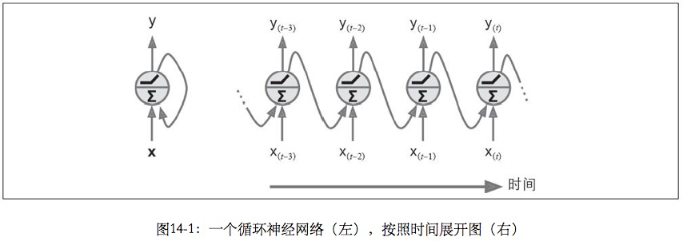 
RNN神经元与DNN、CNN中等前馈神经网络神经元的差别是，多了一条从输出到输入的反向连接 
每个时刻，神经元有两个输入：输入(1)当前时刻的输入特征Xt；输入(2)前一个时刻的输出Yt-1

### (2) 一层循环神经元

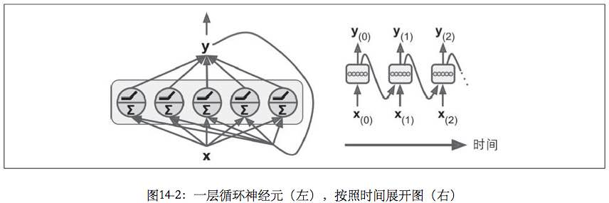 
与单个循环神经元类似，但是是一层神经元，可以接收更多的输入

### (3) 单层循环神经元的输出_1：针对一个样本的输出

 
两种输入、两类权重，外加一个偏置，线性方程求值结果喂给一个激活函数
X_t, Y_t, Y_t-1都是行向量，转之后变成列向量
b是列向量，包含了改层每一个神经元的偏差系数

### (4) 单层循环神经元的输出_2：针对一个mini-batch批次样本的输出

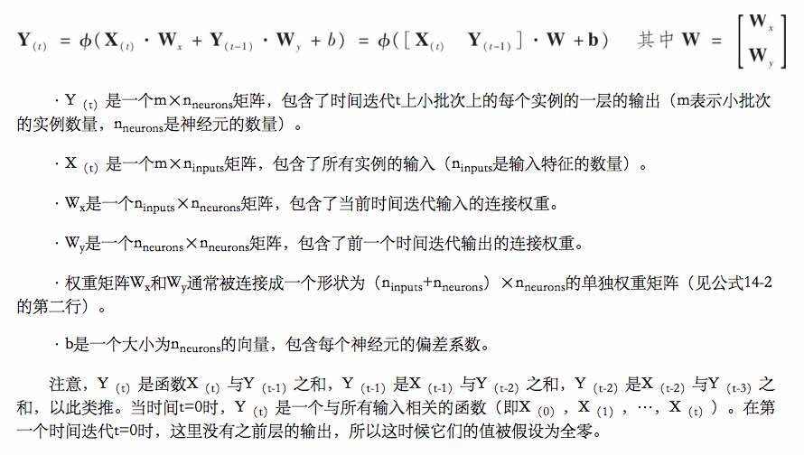 
Xt, Yt-1, Yt都是矩阵，行对应一个样本，这些样本共用了相同的权重矩阵Wx, Wy

### (5) 例子

代码：[代码RNN.01 RNN原理演示：Manual 实现基本的RNN预测（不含权重训练）](15_rnn_code/15_code_01_rnn_demo_manually.md)

## 3.四种RNN类型

下面图中的黑盒不再是单层循环神经元，它是一个多层网络神经元组成的神经网络 

1. 序列到序列网络：如预测股票价格 
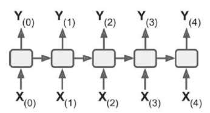 

2. 序列到向量网络：如根据影评预测受欢迎程度 
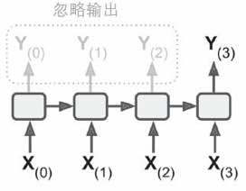 

3. 向量到序列网络：如根据图像预测标题 
 

4. 延迟的序列到序列网络（编码器->解码器）：如机器翻译（语言A的词序列->内容向量->语言B的词序列） 
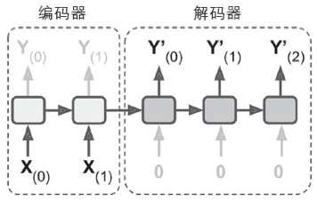 

## 4.用TensorFlow来展开RNN时间序列

> 实现基本的RNN预测、不含模型训练、模型权重随机生成

**手动实现**： 

* [代码RNN.01 RNN原理演示：Manual 实现基本的RNN预测（不含权重训练）](15_rnn_code/15_code_01_rnn_demo_manually.md)

**用TF API static_run()实现**： 

* [代码RNN.02 RNN原理演示：使用TF高层API static_run()展开RNN预测（实现基本预测、不含模型权重训练）
](15_rnn_code/15_code_02_rnn_demo_with_tf_static_run.md)

	> 缺点：在正向传播期间、为了能够计算反向传播时的梯度值，系统必须存储所有的张量值，很可能显卡OOM
用TF API  dynamic_run()实现：

* [代码RNN.03 RNN原理演示：使用TF高层API dynamic_run()展开RNN预测（实现基本预测、不含模型权重训练）
](15_rnn_code/15_code_03_rnn_demo_with_tf_dynamic_run.md)

	> 要点：设置swap_memory=True将GPU内存调换到CPU内存 
	> 原理：每个时间迭代使用单独的特征输入张量，和单独的输出张量，不需要堆叠、拆分或调换

**处理变长输入** 

* [代码RNN.04 RNN代码技巧：处理变长输入](15_rnn_code/15_code_04_process_variant_length_input.md)

	> 方法: 在调用`static_run()`或者`dynamic_run()`时设置`sequence_length`参数，该参数是一个一维张量(数组)，指示每个样本的序列长度，当样本长度不足时，会用零来填充

**处理变长输出** 

> 与变长输入不同、并不能预先知道变长输出的输出长度，因此无法使用零填充的方法。解决办法是使用EOS结束令牌(End Of Sequence)

## 5.RNN模型训练原理：定期反向传播（时间反向传播, BPTT)

基于时间的反向传播，过程如下

1. 沿着虚线方向正向传播、根据输入(当前时间点的特征X(4)，前一个时间的输出Y(3)）计算当前时间的输出Y(4) 
2. 根据时间窗口内的输出(Y(2), Y(3), Y(4))计算损失值，C是损失函数Cost Function(tmin=2,tmax=4) 
3. 实线为Cost Function梯度的反向传播，来更新网络参数（梯度通过被Cost Funtion所使用的所有输出，即途中的Y(2),Y(3), Y(4)传播，而不仅仅是醉总输出）
此外，相同的参数W和b被用于每个时间迭代，所以反向传播可以做正确的事情并总结所有的时间迭代 

## 6.RNN分类器：

识别MNST图像 (其实CNN比RNN更适合做图像分类，这里用MNST图像分类来作为例子，只是因为和前面章节的比较相似) 

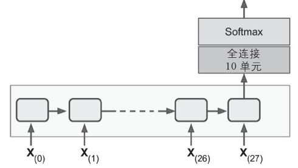

[代码RNN.05 RNN例子：MNIST图像分类（单层RNN）](15_rnn_code/15_code_05_mnist_classification_with_single_layer_rnn.md) 
[代码RNN.06 RNN例子：MNIST图像分类（多层RNN）](15_rnn_code/15_code_06_mnist_classification_with_multiple_layer_rnn.md)

## 7. RNN时间序列预测

**应用**：如股票价格、空气温度、脑波模式等 
**样本数据**： 

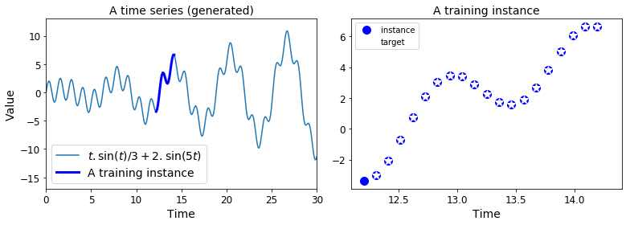 

**左图**：时间序列；**右图**：从时间序列得到的训练样本

* **输入序列**：输入序列中随机选20个连续值(时间点[-20,-1])，记为Y20(t-1)
* **目标序列**：X值(在时间迭代上)后移一个(时间点[-19, 0])，记为Y20t
* **样本X值**：当前时刻(时间点[0,0])的其他特征(竞争股票价格、分析师评价等)，记为Xt
* **模型**：根据[Y20(t-1), Xt] > [Y20t]训练模型参数

**RNN按时间序列展开后如下图，每个柱状体代表一个时间片 **
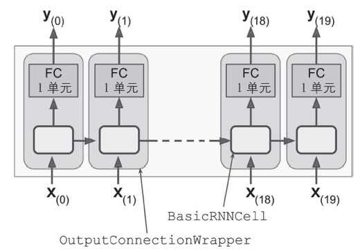 
以第2个柱状体为例: 

* **输入/输出**: 	
	* 输入为前20个时间片的样本Y值（Y(0)->Y(19))，当前时间片的特征（X(0)) 
	* 输出为当前时间片的样本Y值的预测值Y(1) 
* **FC**(tensor flow的`outputProjectionWrapper`):  
	* 是一个全联接层，用来把单层神经元（FC下面的方框）的K个输出映射成一个一维的数值（如股价）

**代码**：[代码RNN.07 RNN时间序列（用OutputProjectionWrapper实现全联接层）](15_rnn_code/15_code_07_time_series_with_rnn.md) 

> 上述代码的**缺点**是：OutputProjectionWrapper直接装饰在BasicRNNCell上，20个时间片的X值要分开依次经过FC单元，改造方法如下：

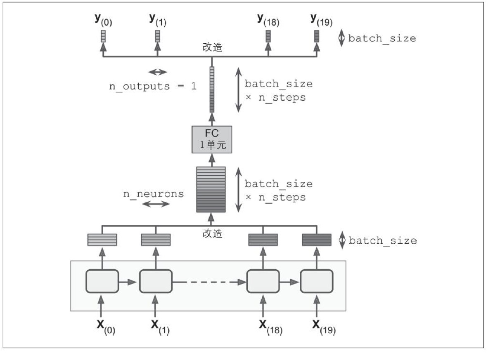

**改造后的代码**：[代码RNN.08 RNN时间序列（手动实现全联接层）](15_rnn_code/15_code_08_time_series_with_rnn_2.md)

~~~python
# 手动实现的全联接层（没有用OutputProjectionWrapper）
stacked_rnn_outputs = tf.reshape(rnn_outputs, [-1, n_neurons])   #rnn_outputs格式为[None, n_steps=20, n_inputs=1],  format成[None,100] 
stacked_outputs = tf.layers.dense(stacked_rnn_outputs, n_outputs)  #stacked_output格式为[None, 100]
outputs = tf.reshape(stacked_outputs, [-1, n_steps, n_outputs])    #格式化成[Nont, n_steps=20, n_input=1], 能与Y值对齐，计算均方误差就可以
loss = tf.reduce_mean(tf.square(outputs - y))
…
~~~

备注：上述代码所使用的特征中只包含前序时间片的序列值，不包含当前时间片的外部特征，如果想使用当前时间片的外部特征，参考[代码RNN.10 多层RNN](15_rnn_code/15_code_10_multi_layer_rnn.md) 

## 8. 创造性RNN

功能：

* 提供一个序列给模型，由模型来预测序列中下一个数值
* 提供一个种子序列给模型，由模型预测下一个值，依次迭代，生成一个完整的预测序列

模型：可以用上一个小节生成的模型来预测
备注：种子序列会影响生成的预测序列

例子：[代码RNN.09 创造性RNN （预测序列下一个值 & 序列生成）](15_rnn_code/15_code_09_series_generation.md) 

## 9. 多层RNN

### (1)对比单层RNN(BasicRNNCell)与多层RNN(MultiRNNCell)

单层RNN按时间序列展开 
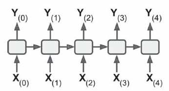

多层RNN按时间序列展开 

### (2) 代码编写方法如下，用`MultiRnnCell`封装多个`BasicRNNCell`，其他部分与单层RNN相同

~~~python
n_neurons = 100  # 每层100个神经元
n_layers = 3     # 3层
layers = [tf.nn.rnn_cell.BasicRNNCell(num_units=n_neurons) for layer in range(n_layers)]
multi_layer_cell = tf.nn.rnn_cell.MultiRNNCell(layers)
# 时间序列展开
outputs, states = tf.nn.dynamic_rnn(multi_layer_cell, X, dtype=tf.float32)
~~~

[代码RNN.10 多层RNN](15_rnn_code/15_code_10_multi_layer_rnn.md) 
[代码RNN.06 RNN例子：MNIST图像分类（多层RNN）](15_rnn_code/15_code_06_mnist_classification_with_multiple_layer_rnn.md) 

### (3) 在多个GPU中分配一个深层RNN

`MultiRNNCell`将一组`BasicRNNCell`组装再一起，但是如果试图把这些`BasicRNNCell`分配到不同的`GPU`上，却会失败，原因是`BasicRNNCell`只是工厂，并不是真正的`RNN Cell` 
正确的方法是使用`DeviceCellWraper` 
[代码RNN.11 将多层RNN中组装在MultiRNNCell中的BasicRNNCell分配到不同的GPU](15_rnn_code/15_code_11_multi_layer_with_multiple_gpu.md)

## 10.Drop Out

使用Drop Out机制防止过拟合 

* 方法(1)：在RNN层之后加一个Drop Out层 
* 方法(2)：给每个RNN层提供Drop Out机制 

注意事项： 

* 因为API限制，需要用DropWarpper来包装BasicRNNCell,下面的代码中，每一层的 RNN 的输入前都应用了 Dropout，Dropout 的概率为 50%。 

	~~~python
	keep_prob = 0.5
	
	cell = tf.contrib.rnn.BasicRNNCell(num_units=n_neurons)
	cell_drop = tf.contrib.rnn.DropoutWrapper(cell, input_keep_prob=keep_prob)
	multi_layer_cell = tf.contrib.rnn.MultiRNNCell([cell_drop]*n_layers)
	rnn_outputs, states = tf.nn.dynamic_rnn(multi_layer_cell, X, dtype=tf.float32)
	~~~
	
	同时也可以通过设置output_keep_prob来在输出应用 Dropout 技术

* drop-out只需要在训练时开启，预测时不希望开启drop-out。`DropoutWapper`还不支持`is_training`选项，需要通过手动实现这个开关 

	~~~python
	import sys
	is_training  = (sys.argv[-1] == "train")
	X = tf.placeholder(tf.float32, [None, n_steps, n_inputs])
	y = tf.placeholder(tf.float32, [None, n_steps, n_outputs])
	cell = tf.contrib.rnn.BasicRNNCell(num_units=n_neurons)
	if is_training:
		cell = tf.contrib.rnn.DropoutWrapper(cell, input_keep_prob=keep_prob)
	multi_layer_cell = tf.contrib.rnn.MultiRNNCell([cell]*n_layers)
	rnn_outpus, status = tf.nn.dynamic_rnn(multi_layer_cell, X, dtype=tf.float32)

	[...] # bulid the rest of the graph
	init = tf.global_variables_initializer()
	saver = tf.train.Saver()
	
	with tf.Session() as sess:
   		if is_training:
			init.run()
			for iteration in range(n_iterations):
				[...] # train the model
			save_path = saver.save(sess, "/tmp/my_model.ckpt")
		else:
			saver.restore(sess, "/tmp/my_model.ckpt")
			[...] # use the model
	~~~

完整代码：[代码RNN.12 RNN Drop out](15_rnn_code/15_code_12_rnn_drop_out.md)

## 11.RNN覆盖的时间迭代很多时的训练难点
(1) RNN按时间迭代展开时会展开成一个非常深的网络，产生梯度消失/爆炸的问题，导致无法收敛
常规缓解办法如下，然而展开一个中等长度的序列，仍然训练起来非常慢

* 良好的模型参数初始化
* 非饱和激活方法(ReLU)等
* 批次归一化
* 梯度裁剪
* 更快的优化器

时间截断反向传播(Truncated Backpropagation Through Time)，通过简单截断输入序列来实现，例如如下方法

* 减少`n_steps`，缺点是无法学习长期模式，只能学习`n_steps`跨度的短期模式
* 让训练数据中同时包含新旧数据(如过去5年、5月的粗粒度数据 + 过去5天的细粒度数据），缺点是会忽略过去确实有用的细粒度数据（如去年的选举结果）

(2) 记忆衰退：随着时间片的迭代，早期的记忆逐渐被丢失，然后有可能关键信息来自于早期的记忆

> 例如：一篇影评、开始部分提到“我很喜欢这部电影”、随后写了很多改进建议。如果丢弃开始部分，对影评的主旨会产生误解

## 12. LSTM长短期记忆单元

使用：API简单(把前面例子中的BasicRNNCell替换成BasicLSTM就可以)，收敛更快，并且能够检测数据中的长期依赖  

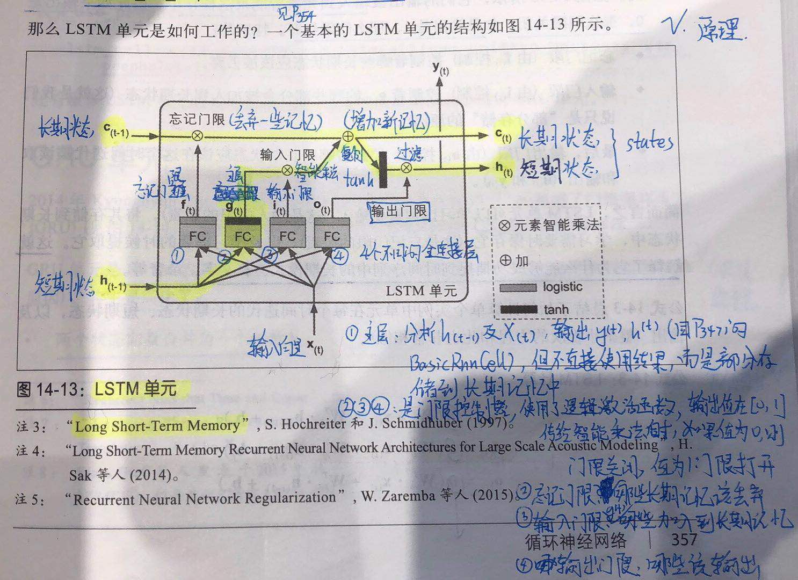

LSTM结构如上图，其中：

* h(t)代表hidden对应时间片t
* c(t)代表constant长期状态在时间片t的值
* x(t)是时间片t的外部特征
* f(t)代表forget，表示忘记门限
* g(t)代表generate，表示主层
* i(t)代表input，表示输入门限
* o(t)代表output，表示输出门限


权重计算公式如上（ρ是激活函数，x是智能乘法） 
代码编写： 

~~~python
lstm_cell = tf.contrib.rnn.BasicLSTMCell(num_units = n_neurons)
~~~

例子：[代码RNN.13 RNN LSTM长期记忆单元、窥视孔连接、GRU](15_rnn_code/15_code_13_lstm_and_gru.md)

## 13. 窥视孔连接

LSTM变种、增加长期状态作用于4个门限

**所解决的问题**： 在基本LSTM(BasicLSTMCell)中，4个门限(input,output,forget,generate)只能接触到短期状态h(t-1)和外部特征X(t)，接触不到长期状态c(t-1)

**解决方法**：让4个控制门限接触到长期状态

* 让忘记门限(f(t))和输入门限(i(t))接触到长期状态c(t-1)
* 让输出门限(o(t))接触到长期状态c(t)

代码编写：

~~~python
lstm_cell = tf.congtrib.rnn.LSTMCell(num_units=n_neurons, use_peehpoles=True)
~~~

例子：[代码RNN.13 RNN LSTM长期记忆单元、窥视孔连接、GRU](15_rnn_code/15_code_13_lstm_and_gru.md)

> 将其中的`tf.nn.rnn_cell.BasicLSTMCell(num_units=n_neurons)`替换成`tf.nn.rnn_cell.LSTMCell(num_units=n_neurons, use_peepholes=True)`

## 14. GRU单元

LSTM变种、是简化版本、效果和LSTM差不多但是训练速度快 

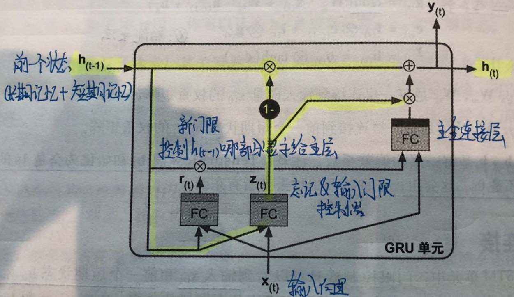

结构如上图。简化的内容包括：

* 短期状态h(t)和长期状态c(t)合并到同一个向量h(t)中
* 忘记门限f(t)和输入门限i(t)合并成一个z(t):  为1时相当于输入门限打开忘记门限关闭；为0时相当于输入门限关闭忘记门限打开
* 取消了输出门限o(t)，全部输出给下一个时间片，但是下一个时间片会使用新门限r(t+1)来决定哪些部门将显示给主层

 

权重公式如上，其中ρ是logistic激活函数，x是智能乘法

代码编写：

~~~python
gru_cell = tf.contrib.rnn.GRUCell(num_units=n_neurons) 
~~~

例子：

> 将其中的`tf.nn.rnn_cell.BasicLSTMCell(num_units=n_neurons)`替换成`tf.nn.rnn_cell.GRUCell(num_units=n_neurons)`

## 15.自然语言处理.Embedding

**用途**：将词表示为小而密集的向量（如150维向量），相近的词有相近的向量表示，称为Embedding 
**参考**：Word2Vec(https://goo.gl/edArdi) 
**训练过程**： 
(1)分词：将句子分解成一系列已知的词 
(2)停用词：用预定义的令牌替换未知的词，例如

> 用[NUM]替换数字 
> 用[URL]替换URL等

(3)	得到已知单词列表后，可以用单词在字典中的数字标识符来表示单词

[代码RNN.14 RNN 自然语言处理.Embedding](15_rnn_code/15_code_14_embedding_with_rnn.md)

## 16.自然语言处理.Seq2Seq：机器翻译

**参考资料**：Seq2Seq (https://goo.gl/L82gvS) 

**处理过程**： 
(1) 英语句子(倒序) -> 编码器(embedding查询) -> 解码器(embedding查询) -> softmax -> 法语翻译预测(序列`[1, n_step]`) -> 法语翻译(序列`[0, n_step-1]`)  
(2) 用(法语翻译预测, 真实翻译)计算交叉熵，用交叉熵作为损失函数，来反向传播，训练模型得到模型参数 

**代码演示(非完整)**：[代码RNN.15 RNN 自然语言处理.seq2seq.机器翻译](15_rnn_code/15_code_15_seq2seq_with_rnn.md) 

**进阶阅读**：TensorFlow的seq2seq教程，以及rnn/translate/seq2seq_model.py，在进阶阅读中，需要解决更多问题，例如： 

* 句子不再是定长
* 解决词汇量增到很大时、softmax预测出的每个词概率太低的问题（`sampled_softmax_loss()`)
* 实现了一个attention机制，让解码器能够窥视到输入序列的内容，参考资料
    * 使用attention做机器翻译: [https://goo.gl/8RCous](https://goo.gl/8RCous)
    * 机器阅读：[https://goo.gl/X0Nau8](https://goo.gl/X0Nau8)
    * 图像捕捉：[https://goo.gl/xmhvfK](https://goo.gl/xmhvfK)

> 本教程的实现使用了`tf.nn.legacy_seq2seq`模块，该模块提供了轻松构建各种编解码器模型的工具。 例如，`embedding_rnn_seq2seq()`函数会创建一个简单的编解码器模型，它会自动为你处理单词嵌入。 另外此代码可能会很快更新，来使用新的`tf.nn.seq2seq`模块
