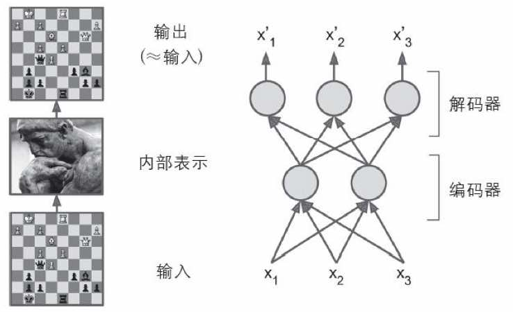
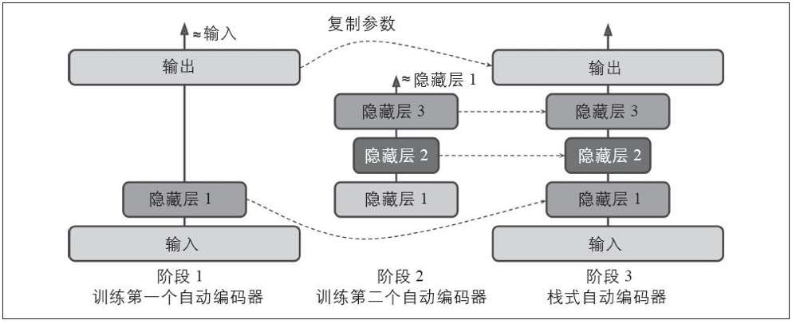
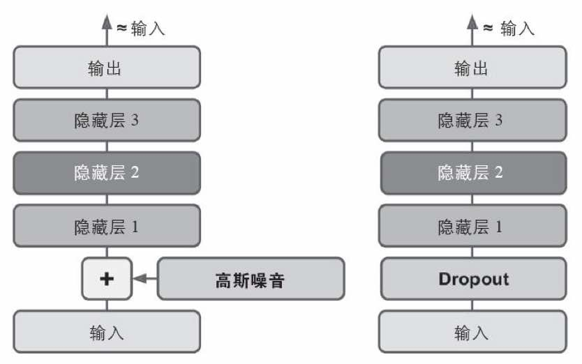
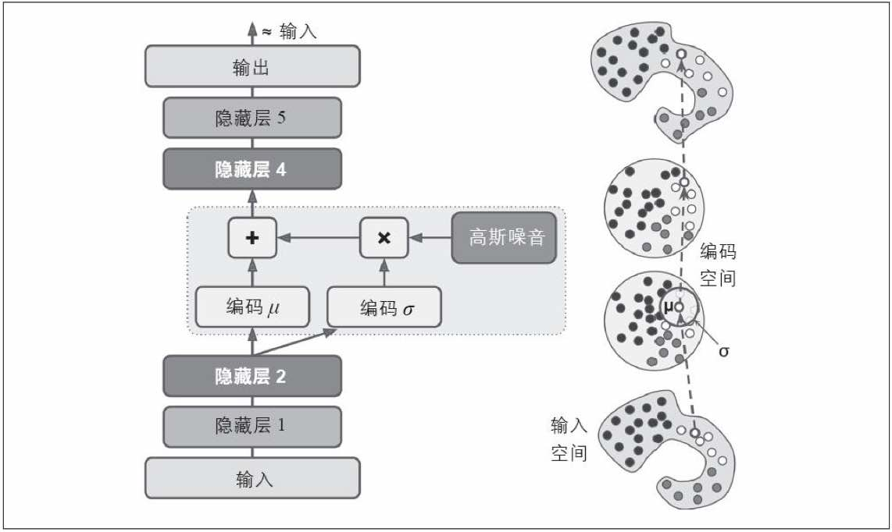

# 自编码机(Auto Encoders)

## 1.用途
**编码**：无监督的情况下，学习有效表示输入数据（编码）的ANN 
**降维**：编码的维度通常比输入数据维度低很多，因此也可以用来降维 
**无监督预训练**：作为强大的特征检测器，可用于DNN的无监督训练 
**生成模型**：生产与训练数据非常相似的数据（生成模型）、如使用面部图片训练自动编码器生成新的面部图片 
**降噪** 

## 2.原理

输入和输出时相同的样本X值，因此可以进行无监督训练，成本函数为重建Loss。同时因为“内部表示”的维度比样本维度低，会迫使模型进行训练，只保留最有代表性的数据到编码中

## 3.用不完整的线性自动编码机实现PCA

构建3层ANN网络，1层Input，1层Output （Input，Output的形状相同），中间1层Coding层 
不使用激活函数，直接用logits的均方差作为损失函数 

[代码AutoEncoders.01: 降维](16_auto_encoder_code/16_code_01_autoencoder_for_dimension_reduction.md)

## 4.栈式Stacked)自动编码器：一次训训练完所有的层

**好处**：多个隐藏层可以学习到更复杂的编码
**注意事项**：不要让自动编码器变的太强大、导致泛化能力太弱

[代码AutoEncoders.02: 栈式(Stacked)自动编码器1-所有层一起训练](16_auto_encoder_code/16_code_02_stacked_autoencoder_1_all_layer_trained_together.md)

## 5.栈式(Stacked)式自动编码器：权重绑定

因为编码层和解码层是对称的，没有必要分开训练，可以将编码层的权重与解码层的权重联系起来

**好处**：可以减少一半的训练参数，提高训练速度 
**问题**：增加了过拟合的风险 
**编写**：

* `fully_connected`, `dense`API不支持权重绑定，需要自己实现
* 假定自动编码器共有N层（`L(1)`是输入层，`L(N/2)`是最中间的编码层，`L(N)`是输出层：`N`是奇数)，权重简单定义为`W(N-L+1)=W(L)`的转置 （其中L=1,2,…,N/2)

[代码AutoEncoders.03: 栈式(Stacked)自动编码器2-权重绑定(Tying weights)](16_auto_encoder_code/16_code_03_stacked_autoencoder_2_typing_weight.md)

## 6. 栈式(Stacked)式自动编码器：一次训练一个自动编码器
**用途**：采用分阶段训练的方法，每阶段只训练一层编码和一层解码器，将多层编码解码器堆叠起来，轻松组成一个非常深的栈式自动编码器 

**方法1**：每阶段使用不同的tensorflow图 
 

* 由外向内每一阶段训练2层，隐藏层的输出被捕获作为下一阶段的样本
* 所有阶段都训练完之后，复制所有阶段（所有层）的模型参数和偏置，构建成自动编码

[代码AutoEncoders.04: 栈式(Stacked)自动编码器3 - 一次训练一个自动编码器(在多张图中)
](16_auto_encoder_code/06_code_04_stacked_autoencoder_3_one_time_one_encoder_in_multiple_graph.md)

**方法2**：各阶段使用同一个tensorflow图 

* 阶段一（左侧）：用原始样本训练输出层、隐藏层1（跳过隐藏层2、3）
* 阶段二（右侧）：用隐藏层1的输出，训练隐藏层2、3（冻结隐藏层1、输出层的模型参数的前提下训练）
* 因为hidden1在阶段2是冻结的，相同样本输出相同。缓存hidden1的输出，可以避免重新计算、加快训练速度

[代码AutoEncoders.05: 栈式(Stacked)自动编码器3 - 一次训练一个自动编码器(在单张图中)](16_auto_encoder_code/16_code_05_stacked_autoencoder_4_one_time_one_encoder_in_single_graph.md)

## 7.自动编码器效果评估：重建可视化

评估自动编码器的方法是：比较输入样本，和编码器输出的重建样本，两者必须相当相似，差异应该是一些不重要的细节才行

[代码AutoEncoders.06：重建可视化](16_auto_encoder_code/16_code_06_visualizing_the_reconstructions.md)

## 8.自动编码器应用：特征可视化，查看自动编码器学会了哪些特征

**方法一**（对抽象程度最高的顶层神经元效果最好）: 对每个顶层神经元，查看激活它最多的样本 

**方法二**（对抽象层度不高的底层神经元）: 为每个神经元，创建一个图像，每个图像像素代表连接到该神经元的权重 
[代码AutoEncoders.07.特征可视化](16_auto_encoder_code/16_code_07_visualizing_extracted_features.md)

**方法三**（非常有用）：向自动编码器随机输入图像，测量感兴趣的神经元的激活，然后执行反向传播，以使得模型向让神经元激活更多的方式来调整图像，随着迭代次数的增加，图像逐渐变成令神经元兴奋的图像 

**方法四**（简单）：使用自动编码器执行无监督预训练，然后用在一个标注样本集上做有监督训练任务（如分类器），根据分类效果验证自动编码器学到的特征是否有用 

## 9.自动编码器应用：无监督预训练

复杂监督任务，没有足够的已标记数据 
方法： 
(1) 训练一个堆叠的自动编码器（无监督预训练）： 
(2) 复用预训练的到的低层网络，使用已标记的数据进一步训练： 
[代码AutoEncoders.08: Unsupervised pretraining](16_auto_encoder_code/16_code_08_unsupervised_pretraining.md)

## 10.自动编码器训练：通过去噪的过程来强制自动编码器学到有用特征

原理：给样本增加噪声，让自动编码器恢复原始的无噪音的输入，这种方法阻止了自动编码器简单复制其输入到输出，强迫其找到数据中的模式 

噪声添加方式：(1)添加纯高斯噪声到输入中 (2) 随机打断输入（如在输入层使用Dropout） 

[代码AutoEncoders.09：借助降噪让模型学习特征](16_auto_encoder_code/16_code_09_feature_learning_with_noise.md)

## 11.自动编码器训练：增加稀疏性约束

原理：通过增加系属性约束、推动AutoEncoder减小编码层中活动神经元到一个合适的程度（例如：可能使得编码层只有5%显著激活的神经元），迫使AutoEncoder使用少量激活神经元的组合来表示输入，进而编码层的每个神经元都代表一个有用特征 

难点：如何测量AutoEncoder编码层的实际激活程度、并使其向目标激活程度靠近 
方法： 
(1) 在每个epoch，用一个样本量充足的mini-batch训练模型，测量编码层(最中间那层)中的神经元平均激活度 
(2) 根据平均激活度计算一个稀疏性损失 

* 方法1：用平方误差，例如目标激活度是0.1，实际激活度是0.3，稀疏性损失就是(0.3-0.1)^2
* 方法2：用KL散度来计算稀疏性损失，它比平方误差有更强的梯度

(3) 将稀疏性损失添加到成本函数中，并配以个超参数，控制稀疏度损失值的权重 

* 稀疏度损失值权重过高：实际激活度将非常接近目标激活度，但模型可能不能正确地重建输入样本
* 稀疏度损失值权重过低：模型将忽略大多数稀疏性目标，并且学不到什么有用的特征

KL散度(Kullback-Leibler，见CH04)


代码：
[代码AutoEncoders.10. Kullback-Leibler散度公式可视化](16_auto_encoder_code/16_code_10_kullback_leibler.md)
[代码AutoEncoders.11：借助稀疏性约束让模型学习特征](16_auto_encoder_code/16_code_11_feature_learning_with_sparsity_constrain.md)

## 12.自动编码器应用：用变分自动编码机(Variational Autoencoder)生成新样本

**论文**：[https://goo.gl/NZq7r2](https://goo.gl/NZq7r2) 

**特点**： 
(1)	是概率自动编码机、输出具有一定随机性 
(2)	是生成式自动编码器，一位置可以生成看起来像是从训练样本中采样的到的新实例一样 
(3)	上面的特性类似于RBMs(书本附录E)，但是更加容易训练，采样过程更快(无需像RBMs那样先等待网络达到一个“热平衡”状态才能开始采样 

**模型结构**：最中间的编码层是用了平均编码 + 高斯噪声的编码方式 


~~~python
hidden2      = my_dense_layer(hidden1, n_hidden2)
hidden3_mean = my_dense_layer(hidden2, n_hidden3, activation=None) # 平均编码
hidden3_sigma 	= my_dense_layer(hidden2, n_hidden3, activation=None) # 标准差编码 = 平均编码 * 高斯噪声
noise        = tf.random_normal(tf.shape(hidden3_sigma), dtype=tf.float32) # 高斯噪声
hidden3 	   = hidden3_mean + hidden3_sigma * noise # 编码层 = 平均编码+标准差编码 = 平均编码+平均编码*高斯噪声
~~~

**成本函数(版本1)：分为两部分** 
1. 常规重建成本：交叉熵，推动自动编码器重建输入样本 
2. 潜在损耗：编码的目标高斯分布，与实际分布的KL距离，使得编码器看起来像是从简单的高斯分布中采样 

~~~python
logits = my_dense_layer(hidden5, n_outputs, activation=None)
xentropy = tf.nn.sigmoid_cross_entropy_with_logits(labels=X, logits=logits) # 常规重建成本：交叉熵，推动自动编码器重建输入样本
reconstruction_loss = tf.reduce_sum(tf.nn.sigmoid_cross_entropy_with_logits(labels=X, logits=logits))  	# 常规重建成本
latent_loss = 0.5 * tf.reduce_sum(tf.square(hidden3_sigma) + tf.square(hidden3_mean) - 1 - tf.log((1e-10) + tf.square(hidden3_sigma))) 	# 潜在损耗
loss = reconstruction_loss + latent_loss 
~~~

**成本函数(版本2: 加快收敛速度)：分为两部分** 
1.	规重建成本：交叉熵，推动自动编码器重建输入样本（与版本1相同） 
2.	潜在损耗：训练编码器输出γ=log（σ^2），而不是σ。当需要σ时，可以通过σ=exp（γ/2）计算。这使得编码器更容易捕获不同规模的信号，从而帮助提高收敛的速度。 

代码： 
[代码AutoEncoders.12.应用：使用变分编码器(Variational Autoencoder)生成样本](16_auto_encoder_code/16_code_12_rnn_application_1_generate_examples_with_variational_autoencode_1.md) 
[代码AutoEncoders.13.应用：使用变分编码器(Variational Autoencoder)生成样本（加速收敛变体）](16_auto_encoder_code/16_code_13_rnn_application_2_generate_examples_with_variational_autoencode_2.md) 
[代码AutoEncoders.14.应用：使用变分编码器.创建样本](16_auto_encoder_code/16_code_14_rnn_application_3_generate_examples_with_variational_autoencode_3.md) 

## 13.其他自动编码机
收缩自动编码机(CAE)：[https://goo.gl/U5t9Ux](https://goo.gl/U5t9Ux)
> 输入编码的衍生物比较小，相似的输入会的到相似的输出

栈式卷积自动编码机：[https://goo.gl/PTwsol](https://goo.gl/PTwsol)
> 通过卷积层重构图像来学习提取视觉特征

随机生成网络(GSN)：[https://goo.gl/HjON1m](https://goo.gl/HjON1m)
> 去噪自动编码器的推广，增强了生成样本的能力

获胜者(WTA)自动编码器：[https://goo.gl/I1LvzL](https://goo.gl/I1LvzL)
> 训练期间，在计算了编码层所有神经元的激活度之后，只保留训练批次中前k%的激活度，其余都置为0。
> 自然地，这将导致稀疏编码。此外，类似的WTA方法可以用于产生稀疏卷积自动编码器。

对抗自动编码器：[https://goo.gl/enC5fB](https://goo.gl/enC5fB)
> 一个网络被训练来重现输入，同时另一个网络被训练来找到不能正确重建第一个网络的输入。这促使第一个自动编码器学习鲁棒编码。

