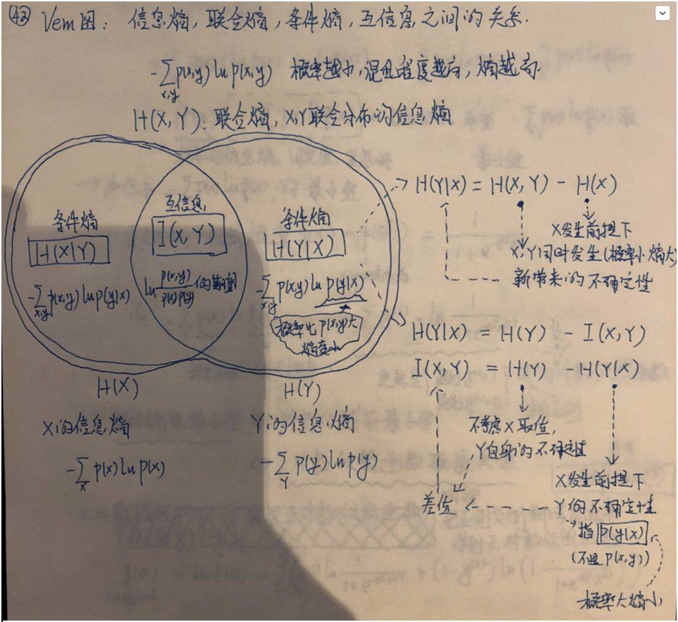

# 附录1: 熵

## 1. 信息熵：
来自于`N`个物品向`K`个箱子装箱的装法，`n`趋向于正无穷时得到的极限值；熵越高、混乱程度越高，分法越多，分到k个箱子的概率趋向相同 
`H(p) = - SUM(P_k*log(P_k))` 
其中`-log(P_k)`叫做事件`k`的信息量，`P_k`即事件`k`发生的概率越小，信息量越大（小概率事件信息量大）

## 2. 联合熵：
`X`、`Y`同时发生这个联合事件的信息熵（1.从信息量的角度来理解；2.从1维度的概率值区间段，扩展到2维的联合概率取值方格来理解） 
`H(X, Y) = - SUM(P(X,Y) * log(P(X,Y))`

## 3. 条件熵：
`X`发生的前提下，`X`、`Y`同时发生新引入的信息熵 (从装箱问题角度理解，分到`X*Y`个格子的分发，相等或多于分到`X`个区间段的格子） 
`H(Y|X) = H(X, Y) - H(X)`

## 4. 相对熵
又叫做：互熵、交叉熵、鉴别信息、Kullback熵、Kullback-Leible散度，K-L距离。 
公式是`D(p||q) = SUM(P(X)*log(P(X)/Q(X))`，理解为对`P(X)`, `Q(X)`两个概率分布，求`P(X)/Q(X)`的数学期望 
对某个X取值:  
*`P(X)=Q(X)`时，对相对熵的贡献程度为`0` 
*`P(X)>Q(X)`时，会相对缓和地增大相对熵`Q(P||Q)` 
*`P(X)<Q(X)`时，会急剧地减小相对熵`Q(P||Q)` 
Logist Regression使用`-D(p||q)`来建模作为影响损失函数的因子，将`P(X)`建模成样本标签值的`0，1分布`，将`Q(X)`建模成logistic函数输出的预测值。
当P(X)=1而Q(X)=0时，相当于正例样本被预测为负例，会急剧减小D(P||Q)， 相当于急剧增加D(Q||P)，从而得到一个急剧增加损失值

## 5. 互信息
`I(X,Y) = D(P(X,Y) || P(X)P(Y)) = SUM(P(X,Y)` 
其中`log(P(X, Y)/(P(X)*P(Y))` 表示两个随机变量X、Y的联合分布与独立分布乘积的相对熵，
用来表示没有`X`时`Y`的不确定性、与给定`X`时`Y`不确定性的差值

## 6. Vem图
 
[../pic/appendix_01_vem.jpg](../pic/appendix_01_vem.jpg) 

